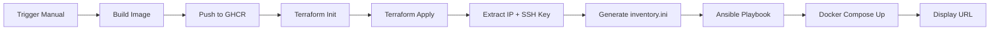

# Student Dashboard - CI/CD Pipeline

Stack Docker complète avec déploiement automatisé sur AWS via GitHub Actions.

## 🏗️ Architecture du Projet

```
┌─────────────────────────────────────────────────────────────────────┐
│                        GitHub Actions                                │
│  ┌──────────┐    ┌───────────┐    ┌────────┐    ┌──────────────┐   │
│  │ Build &  │───▶│ Terraform │───▶│ Bridge │───▶│   Ansible    │   │
│  │  Publish │    │   Apply   │    │        │    │   Deploy     │   │
│  └──────────┘    └───────────┘    └────────┘    └──────────────┘   │
│       │                │               │                │           │
│       ▼                ▼               ▼                ▼           │
│    GHCR            AWS EC2         IP + SSH         Docker          │
│   (Images)        (Instance)        (Key)          Compose          │
└─────────────────────────────────────────────────────────────────────┘

┌─────────────────────────────────────────────────────────────────────┐
│                         AWS EC2 Instance                            │
│  ┌──────────────────────────────────────────────────────────────┐  │
│  │                      Docker Compose                           │  │
│  │  ┌──────────┐  ┌─────────┐  ┌────────┐  ┌───────┐  ┌───────┐│  │
│  │  │ Frontend │  │   API   │  │   DB   │  │ Redis │  │Adminer││  │
│  │  │  :8080   │  │  :8000  │  │ (int)  │  │ (int) │  │ :8081 ││  │
│  │  └──────────┘  └─────────┘  └────────┘  └───────┘  └───────┘│  │
│  └──────────────────────────────────────────────────────────────┘  │
└─────────────────────────────────────────────────────────────────────┘
```

### Services

| Service  | Port | Description |
|----------|------|-------------|
| Frontend | 8080 | Dashboard Nginx (static files) |
| API      | 8000 | FastAPI Python Backend |
| DB       | -    | PostgreSQL (réseau interne) |
| Redis    | -    | Cache Redis (réseau interne) |
| Adminer  | 8081 | Administration DB |

## � Structure du Projet

```
├── .github/
│   └── workflows/
│       ├── deploy.yml              # Pipeline principal (workflow_dispatch)
│       ├── build-test-python.yml   # Tests python
│       ├── security-scan.yml       # Scan de vulnérabilités
│       └── publish-ghcr.yml        # Publication images
├── registry/                       # Infrastructure & Config
│   ├── main.tf                     # Terraform (AWS)
│   ├── playbook.yml                # Ansible (Configuration)
│   └── inventory.ini               # Généré dynamiquement
├── frontend/                       # Fichiers statiques
├── nginx/                          # Configuration Nginx
├── sqlfiles/                       # Scripts SQL d'init
├── docker-compose.yml              # Orchestration
├── python.Dockerfile               # Image API
├── nginx.Dockerfile                # Image Frontend
└── requirements.txt                # Dépendances Python
```

## 🔐 Prérequis - GitHub Secrets

Avant de lancer le pipeline, configurez ces secrets dans **Settings → Secrets and variables → Actions → Repository secrets** :

### Secrets AWS (obligatoires)

| Secret | Description |
|--------|-------------|
| `AWS_ACCESS_KEY_ID` | Clé d'accès IAM AWS |
| `AWS_SECRET_ACCESS_KEY` | Clé secrète IAM AWS |

### Secrets Base de données (obligatoires)

| Secret | Description | Exemple |
|--------|-------------|---------|
| `POSTGRES_USER` | Utilisateur PostgreSQL | `admin` |
| `POSTGRES_PASSWORD` | Mot de passe PostgreSQL | `secretpassword` |
| `POSTGRES_DB` | Nom de la base de données | `dashboard_db` |

> **Note** : Le `GITHUB_TOKEN` est automatiquement fourni par GitHub Actions.

## 🚀 Lancer le Déploiement

### Via GitHub Actions (Production)

1. Allez dans **Actions** → **Deploy to AWS**
2. Cliquez sur **Run workflow**
3. Attendez la fin du pipeline (~5 minutes)
4. L'URL du dashboard s'affiche dans les logs

### En Local (Développement)

```bash
# Cloner le projet
git clone https://github.com/NawfelHilal/dev_avec_docker-main.git
cd dev_avec_docker-main

# Créer le fichier .env
cat > .env << EOF
POSTGRES_HOST=db
POSTGRES_USER=admin
POSTGRES_PASSWORD=secretpassword
POSTGRES_DB=dashboard_db
EOF

# Lancer la stack
docker compose up --build -d

# Accès
# Dashboard: http://localhost:8080
# API: http://localhost:8000
# Adminer: http://localhost:8081
```

## 🔄 Pipeline CI/CD

Le workflow `deploy.yml` exécute séquentiellement :

1. **Build & Publish** : Construction de l'image API et push sur GHCR
2. **Terraform Apply** : Provisionnement de l'instance EC2 AWS
3. **Bridge** : Extraction de l'IP et de la clé SSH depuis Terraform
4. **Ansible Deploy** : Configuration du serveur et déploiement de la stack



## 🛡️ Sécurité

- **No SSH** : Aucune connexion manuelle au serveur requise
- **Secrets chiffrés** : Toutes les credentials dans GitHub Secrets
- **Moindre privilège** : API en utilisateur non-root
- **Isolation réseau** : DB et Redis non exposés
- **Clé SSH éphémère** : Générée par Terraform, jamais stockée

## 🧪 Vérification

```bash
# Health check API
curl http://<IP>:8000/health

# Vérifier les conteneurs (SSH si besoin)
ssh -i key.pem ubuntu@<IP> "docker ps"
```

## 📝 Auteurs

- **Étudiant A** : Infrastructure as Code (Terraform)
- **Étudiant B** : Configuration Management (Ansible)
- **Binôme** : Pipeline d'Orchestration (GitHub Actions)
